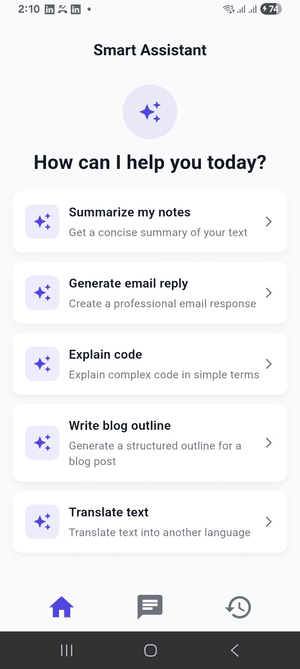
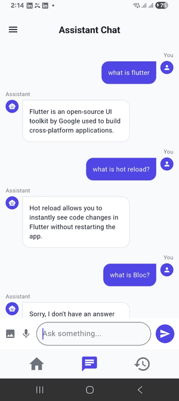
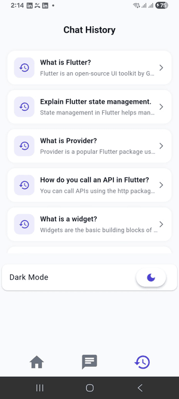
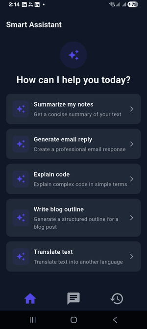
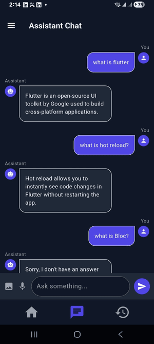
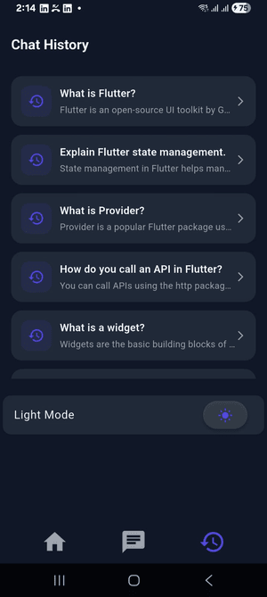
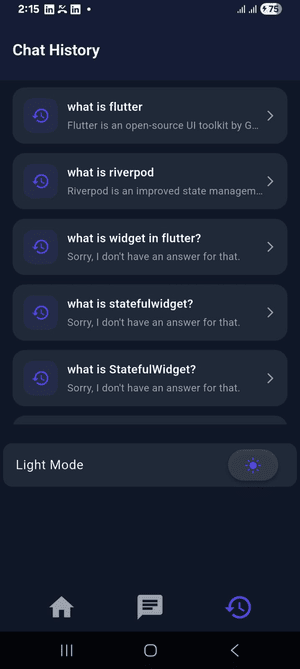

# 🚀 Smart Assistant — Flutter Chat Application

## 🔗 GitHub Repository

👉 https://github.com/Fenirok/smart_assistant

## 📑 Table of Contents

* [Overview](#-overview)
* [Architecture](#-architecture)
* [Project Structure](#-project-structure)
* [Backend Integration](#-backend-integration)
* [Backend API (Hosted)](#-backend-api-hosted)
* [Core Features](#️-core-features)
  * [Chat System](#-chat-system)
  * [Chat History](#-chat-history)
  * [Suggestions (Pagination)](#-suggestions-pagination)
  * [Connectivity Handling](#-connectivity-handling)
  * [Local Storage (Hive)](#-local-storage-hive)
* [Testing Strategy](#-testing-strategy)
* [Key Engineering Decisions](#-key-engineering-decisions)
* [Screenshots](#-screenshots)
* [Setup Instructions](#️-setup-instructions)
* [Dependencies](#-dependencies)
* [Future Improvements](#-future-improvements)
* [Author](#-author)
* [Conclusion](#-conclusion)


---

## Overview

Smart Assistant is a **production-ready Flutter chat application** built using **MVVM + Clean Architecture principles**.

It integrates:

*  Custom backend APIs (hosted)
*  Real-time chat system
*  Chat history with offline fallback
*  Smart suggestions with pagination
*  Connectivity-aware data handling
*  Local persistence using Hive

The project is designed with **scalability, testability, and maintainability** as core priorities.

---

##  Architecture

The app follows a **layered MVVM architecture**:

```text
UI (Screens + Widgets)
        ↓
ViewModel (ChangeNotifier - Provider)
        ↓
Repository Layer
        ↓
Data Sources
   ├── Remote (API)
   └── Local (Hive)
```

---

##  Project Structure

```
lib/
├── constants/
├── data/
│   ├── datasources/
│   │   ├── local/
│   │   └── remote/
│   ├── repositories/
│   └── models/
├── view/
│   ├── screens/
│   ├── widgets/
├── view_model/
```

---

##  Backend Integration

The app connects to a **custom hosted backend API**:

### Endpoints Used:

* Chat API → Send message & receive reply
* Suggestions API → Fetch suggestions list
* Chat History API → Fetch previous conversations

Example:

* Chat API returns structured response (`message`, `reply`)
* Suggestions API supports bulk fetch (used for pagination)

---
##  Backend API (Hosted)

This application integrates with a **custom hosted backend** deployed on Render:

###  Base URL

```
https://mock-chat-api.onrender.com/
```

---

###  API Endpoints

####  Chat API

Handles sending user messages and receiving assistant replies.

```
POST /chat
```

**Full URL:**

```
https://mock-chat-api.onrender.com/chat
```

**Request Body:**

```json
{
  "message": "What is Flutter?"
}
```

**Response:**

```json
{
  "id": "1",
  "status": "success",
  "message": "What is Flutter?",
  "reply": "Flutter is an open-source UI toolkit by Google..."
}
```

---

####  Suggestions API

Provides predefined smart suggestions used in the home screen.

```
GET /suggesitons
```

**Full URL:**

```
https://mock-chat-api.onrender.com/suggesitons
```

**Response:**

```json
{
  "data": [
    {
      "id": "1",
      "title": "What is Flutter?",
      "description": "Learn about Flutter framework"
    }
  ]
}
```

---

####  Chat History API

Returns previous conversations.

```
GET /chat/history
```

**Full URL:**

```
https://mock-chat-api.onrender.com/chat/history
```

**Response:**

```json
{
  "data": [
    {
      "sender": "user",
      "message": "What is Flutter?"
    },
    {
      "sender": "assistant",
      "message": "Flutter is an open-source UI toolkit..."
    }
  ]
}
```

---

### ⚠ Notes

* APIs are **publicly hosted on Render**
* No authentication required (for demo purposes)
* Used for:

    * Chat responses
    * Suggestions list
    * Chat history retrieval

---

###  Integration in App

* API calls handled via **Remote Data Sources**
* Parsed into models and passed through **Repository layer**
* Consumed by **ViewModels**

Example implementation:

* Chat API → `ChatRemoteDataSource`
* Suggestions → `SuggestionRemoteDataSource`
* History → `ChatHistoryRemoteDataSource`

##  Core Features

###  Chat System

* Sends user message to API
* Receives assistant reply
* Shows typing indicator
* Stores messages locally

---

###  Chat History

* Fetches from API when online
* Falls back to Hive when offline
* Converts messages into conversation pairs

---

###  Suggestions (Pagination)

* Loads suggestions from API
* Implements lazy loading
* Auto-fetches more on scroll

---

###  Connectivity Handling

* Detects network changes
* Auto-refresh on reconnect
* Offline-first fallback strategy

---

###  Local Storage (Hive)

* Stores chat messages locally
* Used for:

    * Offline chat history
    * Persistence across sessions

---

##  Testing Strategy

The project includes a **layered testing approach** ensuring reliability.

###  Test Structure

```
test/
├── chat_core_test.dart
├── history_test.dart
├── suggestions_test.dart
└── widget_test.dart
```

---

### 1. Chat Core Testing

Tests:

* Message sending flow
* API response handling
* Error scenarios

Approach:

* Used **Fake Repository** instead of Mockito for stability
* Verified message ordering and correctness

---

### 2. History Testing

Tests:

* Pairing logic of messages
* Conversion into UI-friendly models

Key Logic:

* User + Assistant messages are grouped into conversations

---

### 3. Suggestions Testing

Tests:

* Pagination logic
* Data loading
* Scroll-triggered fetch

Special Handling:

* Used `TestWidgetsFlutterBinding.ensureInitialized()` for connectivity

---

### 4. Widget Testing

Tests UI components:

* ChatBubble
* SuggestionCard
* ChatHistoryCard

Ensures:

* Correct rendering
* UI consistency

---

###  Testing Highlights

* Used **Fake classes instead of Mockito** → reduces flakiness
* Covered **ViewModel + Repository + UI layers**
* Used **realistic test data (not dummy strings)**
* Focused on **logic + behavior instead of over-mocking**

---

##  Key Engineering Decisions

### ✔ MVVM Architecture

* Separates UI and business logic
* Improves testability

---

### ✔ Repository Pattern

* Abstracts data sources
* Makes switching between API/local seamless

---

### ✔ Data-Retrieval-First Design

* Uses Hive for persistence
* Automatically falls back when offline
* Fetches data from API and also do POST at /chat endpoint

---

### ✔ Pagination Strategy

* Efficient loading of large datasets
* Prevents UI blocking

---

### ✔ Connectivity Handling

* Listens to network changes
* Refreshes data automatically

---

##  Screenshots

### Light Mode Screens
    

### Dark Mode Screens
    

### Offline Data Hive Screens
   

---

## 🛠️ Setup Instructions

### 1️. Clone Repository

```bash
git clone https://github.com/Fenirok/smart_assistant.git
cd smart-assistant
```

---

### 2️. Install Dependencies

```bash
flutter pub get
```

---

### 3. Run Application

```bash
flutter run
```

---

##  Dependencies

* `provider` → State management
* `http` → API integration
* `hive` → Local database
* `connectivity_plus` → Network detection

---

##  Future Improvements

* Streaming responses (real-time AI typing)
* Authentication system
* Voice input support
* Dark mode persistence
* Advanced caching strategies

---

##  Author

Aditya Halder

---

##  Conclusion

This project demonstrates:

* Clean architecture implementation
* Real-world API integration
* Offline-first design
* Scalable state management
* Production-grade testing strategy

---

